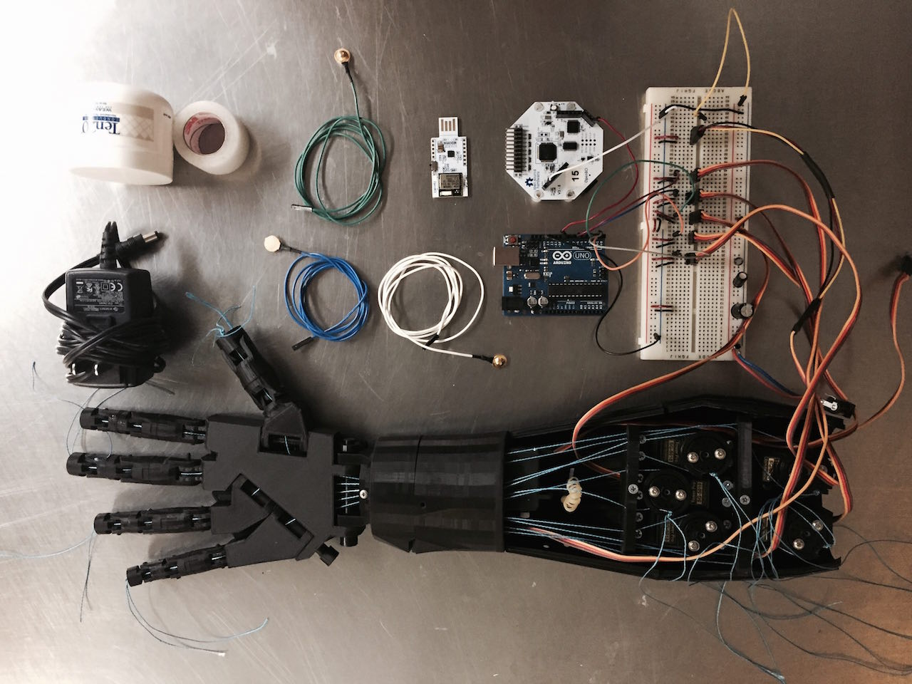
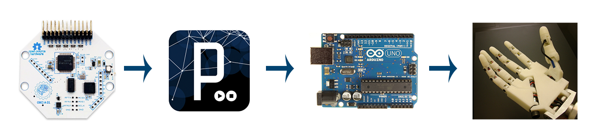

# InMoov_OpenBCI

### Introduction

This repo contains the ongoing development of the connection between [OpenBCI board](http://www.openbci.com/) and the [InMoov Right Hand & Forearm](http://www.inmoov.fr/hand-and-forarm/). OpenBCI is a powerful, high-channel count EMG device in addition to being capable of sampling brain activity. As a result, I think it would be awesome to develop a 8 or 16 channel EMG controlled robotic hand. I believe the implications for low-cost, high-quality, 3D-printable prosthetics are big! 

The InMoov [right hand and forearm](http://www.thingiverse.com/thing:17773) 3D-print files are openly accessible on Thingiverse, and there is a [pretty decent tutorial](http://www.inmoov.fr/hand-and-forarm/) on printing and assembling the hand on the InMoov website. It's not the easiest project to undertake, but it is doable! It took our intern, Rodrigo, and myself about a full week of intermittent work and 3D-printing to get the full hand assembled and moving.

Then it was on to powering it with biosignals from the OpenBCI!



### Where We Are At Now




#### In the Processing GUI
**/OpenBCI_InMoov_wComp/Processing/OpenBCI_GUI/EEG_Processing.pde**

Currently, we have the OpenBCI board recording a single EMG channel and sending it into the OpenBCI Processing GUI where it is being processed. The raw data of this channel is being converted into a filtered microvolt (uV) value that is legible by:

- 60Hz AC environmental noise is removed (using a notch filter)
- the raw wave is adjusted to account for DC ofset
- and a band-pass filter (1-50Hz or 5-50Hz) is applied

Then, as the user flexes and relaxes, upper and lower thresholds are established that represent the "comfortable flex range" of the user for the targeted muscle group. These thresholds continue to update themselves over time to maintain a rolling comfortable flex range. Additionally a rolling average of the previous 1 sec of filtered uV values is contiously updated. Each time this rolling average exceeds the upper threshold, the upper threshold is pushed upward to meet the new upper limit. And each time the user relaxes and the rolling uV average drops below the lower threshold, the lower threshold drops to meet the new lower limit. Both the upper threshold and lower threshold slowly creep toward the rolling average so as to prevent large uV spikes from "breaking" the comfortable range. 

```
if(myAverage >= upperThreshold && myAverage <= acceptableLimitUV){ 
   upperThreshold = myAverage; 
}

if(myAverage <= lowerThreshold){
   lowerThreshold = myAverage; 
}

if(upperThreshold >= myAverage){
  upperThreshold -= (upperThreshold - 25)/(frameRate * 5); //have upper threshold creep downwards to keep range tight
}

if(lowerThreshold <= myAverage){
  lowerThreshold += (25 - lowerThreshold)/(frameRate * 5); //have lower threshold creep upwards to keep range tight
}
    
```

The rolling average of 1 sec helps to smooth the values of the hand so that it doesn't behave irratically, and the constantly changing limits help to ensure that the user is able to comfortably flex (without straining) to get the robot hand to actuate each finger fully yet gradually.

```
for(int i = data_forDisplay_uV[ourChan].length - averagePeriod; i < data_forDisplay_uV[ourChan].length; i++){
   if(data_forDisplay_uV[ourChan][i] <= acceptableLimitUV){ //prevent BIG spikes from effecting the average
     myAverage += abs(data_forDisplay_uV[ourChan][i]);
   }
}

myAverage = myAverage / float(averagePeriod); //finishing the average
    
```


Each frame, the rolling average is mapped (or normalized) between the upper threshold and lower threshold. In processing we set this range from 0-255 to be equivalent to a single byte's worth of "analogue" resolution. This mapped value from 0-255 (representing how hard the user is flexing) is then sent out to an arduino on a separate serial port. 

```
inMoov_output = (int)map(myAverage, lowerThreshold, upperThreshold, 0, 255);

println("inMoov_output: | " + inMoov_output + " |");
inMoov_serial.write(inMoov_output);
```

##### In Arduino
**/OpenBCI_InMoov_wComp/Arduino/InMoov/InMoov.ino**

That analog value (from 0-255) is then mapped to the rotation of the servo motors controlling each finger of the InMoov hand.

##### Code References

- All of the code that makes this full system work can be found in the [OpenBCI_InMoov_wComp subdirectory](https://github.com/conorrussomanno/OpenBCI_InMoov/tree/master/OpenBCI_InMoov_wComp) of this repo. 
- The majority of the Processing GUI code is in the EEG_Processing_User method of the [EEG_Processing.pde file](https://github.com/conorrussomanno/OpenBCI_InMoov/blob/master/OpenBCI_InMoov_wComp/Processing/OpenBCI_GUI/EEG_Processing.pde). 
- The Arduino code that animates the hand by controlling the servos and setting the max/min servo rotation limits of each finger can be found in [InMoov.ino](https://github.com/conorrussomanno/OpenBCI_InMoov/blob/master/OpenBCI_InMoov_wComp/Arduino/InMoov/InMoov.ino).


### The Challenge!

##### OpenBCI --> InMoov Hand

### Helpful Resources


